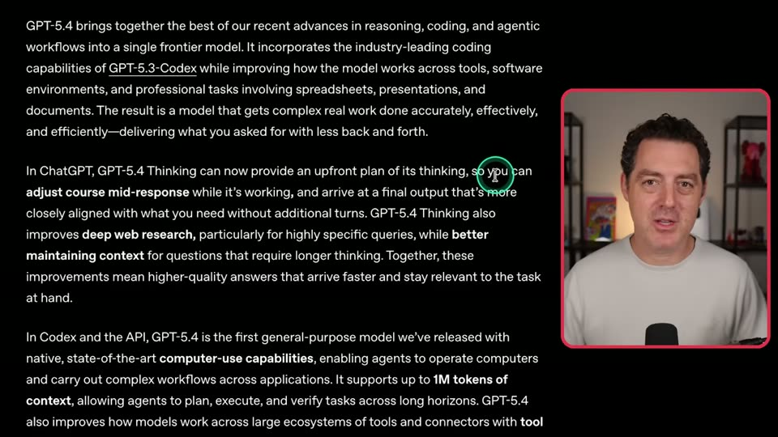
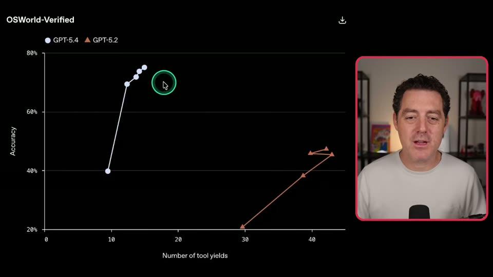
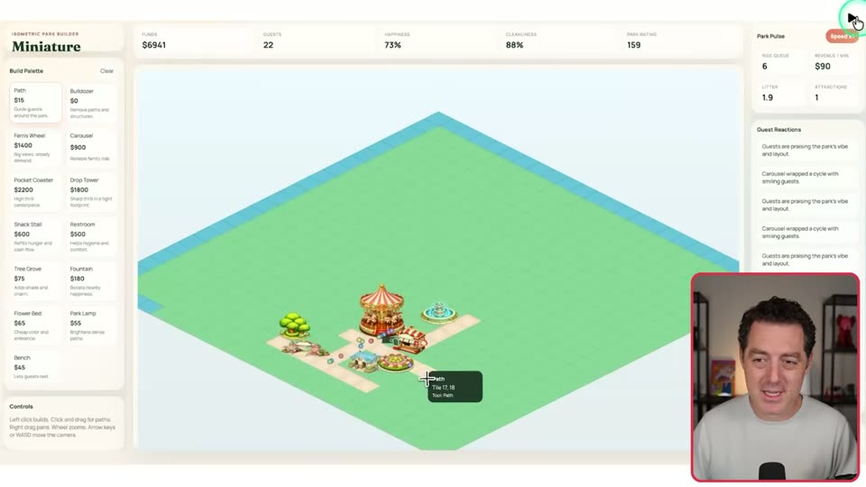
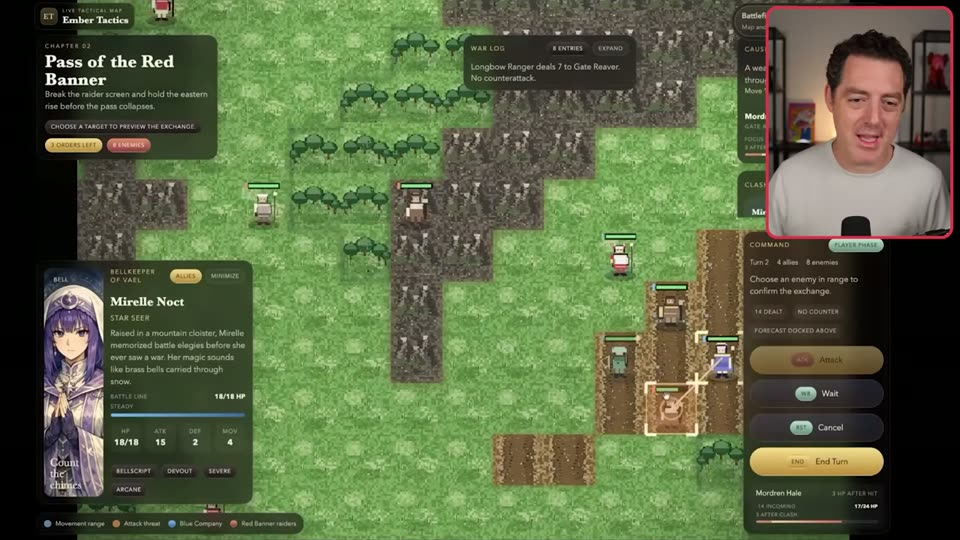

# OpenAI built a Tactical RPG with Phaser

## Why it matters here

This is a compact retrieval anchor for an AI-assisted game workflow that is realistic for hobby browser-game prototyping.

## Summary

- The wrapper article is thin, but it preserves a concrete toolchain tuple from the embedded video: `GPT-5.4 + Codex + Playwright Interactive + image generation + Phaser`.
- The full video is broader than the Phaser article. It frames GPT-5.4 as a general-purpose model for knowledge work, code, browser/computer use, planning, tools, and agentic workflows, then shows benchmarks, productivity demos, game demos, pricing, and prompt-migration advice.
- The Phaser-relevant section appears around `10:05-11:16`: a theme-park simulation and a 2D tactical RPG are presented as examples of richer browser-game prototypes built from light prompts and visual/gameplay iteration.
- The article still works as durable evidence that Phaser-style browser games are becoming a serious target for agent-driven prototypes, but the video should be treated as commentary and demo review rather than a reproducible implementation guide.

## Workspace takeaways

- Treat this as a proof point, not a technical implementation guide. The source does not expose code, architecture details, prompts, or a reproducible build path.
- The durable value is the workflow shape: model-driven code generation, browser/computer use, planning before execution, visual feedback, generated assets, and game/UI iteration in one loop.
- For future Phaser experiments, the game-demo anchors are useful examples of what to verify manually: actual controls, state panels, turn flow, movement/attack affordances, generated asset fit, and whether simulated systems are more than static visuals.
- The pricing and prompt-guide discussion is a reminder to keep high-capability model usage intentional: cache reusable context, reserve expensive output for high-leverage steps, and rewrite prompts when switching between model families.

## Source

- source URL: https://phaser.io/news/2026/03/gpt-5-4-phaser-game-tactical-rpg
- video URL: https://www.youtube.com/watch?v=rvdUBieefR0
- subtitle source: YouTube `en-orig` automatic captions were available through `yt-dlp --list-subs` on 2026-04-22
- transcript policy: the full verbatim caption file is not copied into this repository; the durable KB copy keeps source links, time anchors, selected screenshots, and segment notes for retrieval and review.

## Video notes and screenshots by anchor

### 00:00-02:45: model positioning

Matthew Berman frames `GPT-5.4` as a model that combines broad world knowledge, coding strength, browser use, and agent work. He contrasts that with earlier model specialization, where a strong chat/world model and a strong coding model were separate choices. The key retrieval point is that the video positions GPT-5.4 as a convergence model for real-world knowledge work, not only as a chat model or code-only model.

### 06:57-08:03: planning, tools, computer use, and long context

The presenter summarizes the release positioning as a combined improvement in reasoning, coding, and agentic workflows. The most workspace-relevant detail is the emphasis on up-front planning before execution, tool/software environments, professional artifacts such as spreadsheets and documents, computer-use capabilities, and long-context agent tasks. This maps directly to the workspace's own plan-first workflow: the model value is not just raw generation, but guided execution with a visible plan before high-cost or high-risk work.

### 08:03-09:24: OSWorld and computer-use demos

The OSWorld discussion focuses on accuracy versus number of tool yields. The presenter reads the chart as GPT-5.4 reaching higher accuracy with fewer tool calls than GPT-5.2, making tool-driven work cheaper and more efficient in principle. He then shows Gmail-style computer-use automation: navigating sent mail, labeling messages, and creating calendar invites. The useful durable anchor is not the exact benchmark claim, but the evaluation shape: agent quality should be judged by task success, number of tool calls, and ability to respond to screenshots or UI state.

### 09:39-10:05: bulk data entry

The bulk data-entry demo shows JSON-like structured input being copied into a UI at roughly real-time speed. For workspace purposes, this is a reminder that UI automation demos should be evaluated for data fidelity, speed, and whether the target site supports agentic use without anti-automation blockers.

### 10:05-10:58: theme-park simulation demo

The first game demo is an isometric theme-park simulation named `Miniature`. It includes time-speed controls, a build palette, generated isometric attractions, paths, visitor dots, funds, guest count, happiness, cleanliness, park rating, ride status, and guest reactions. The presenter says the demo was made from a lightly specified prompt and calls out that the logic and metrics are built into the prototype, not just the visuals.

### 10:58-11:16: 2D tactical RPG demo

This is the segment highlighted by the Phaser wrapper article. The demo shows a 2D tactical RPG with a tile map, character cards, movement range, attack/wait/cancel/end-turn controls, battle log, turn state, and generated character art. For retrieval, this is the stronger Phaser/game-dev anchor than the theme-park segment because it demonstrates turn-based combat UI and tactical movement affordances.

### 11:20-12:09: pricing

The pricing section warns that frontier model use remains expensive, especially output-heavy usage and Pro variants. The presenter mentions input caching as a partial mitigation, but notes that output cost remains the hard part. For workspace experiments, this argues for small prompts, cached/reused context, local verification loops, and careful escalation to expensive model calls only when they change the outcome.

### 12:10-12:52: OpenClaw and prompt migration

The presenter recommends trying GPT-5.4 as a primary model in `OpenClaw`, but warns that prompting it differs from prompting `Opus` or Claude-family models. His practical suggestion is to use a model-specific prompting guide and maintain separate prompt sets where needed. For this workspace, keep prompt behavior as versioned workflow knowledge instead of assuming one prompt style transfers unchanged across frontier models.

## Follow-up

- Capture stronger implementation lessons if OpenAI publishes a repo, technical write-up, or more detailed showcase page for the RPG.
