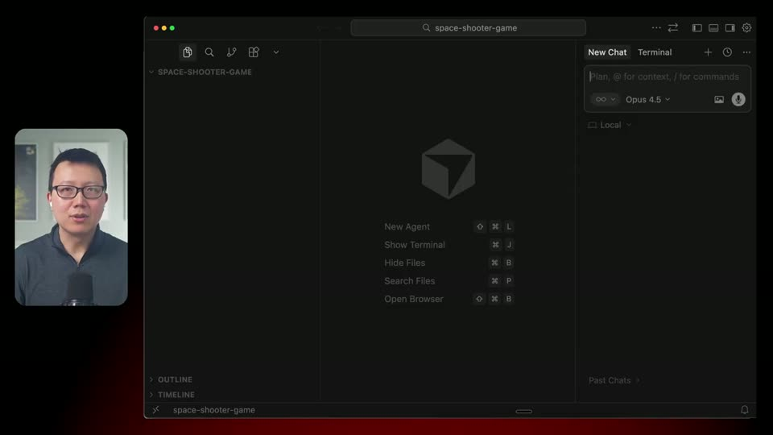
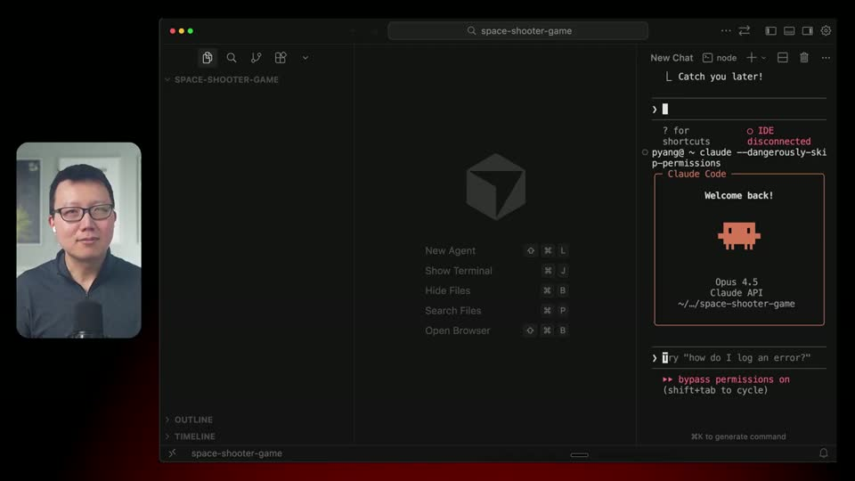
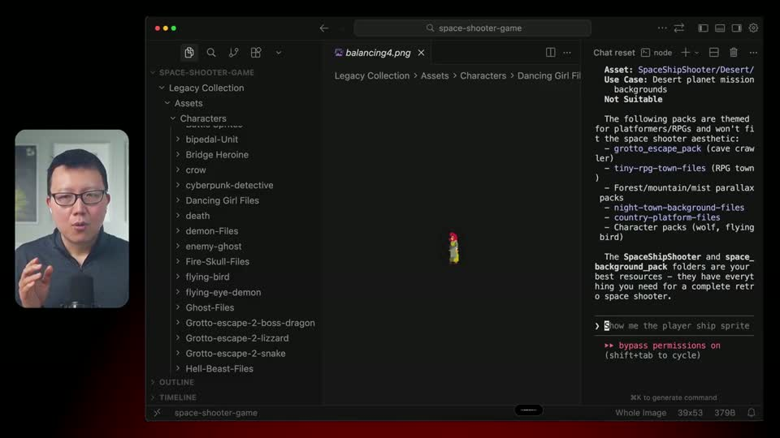
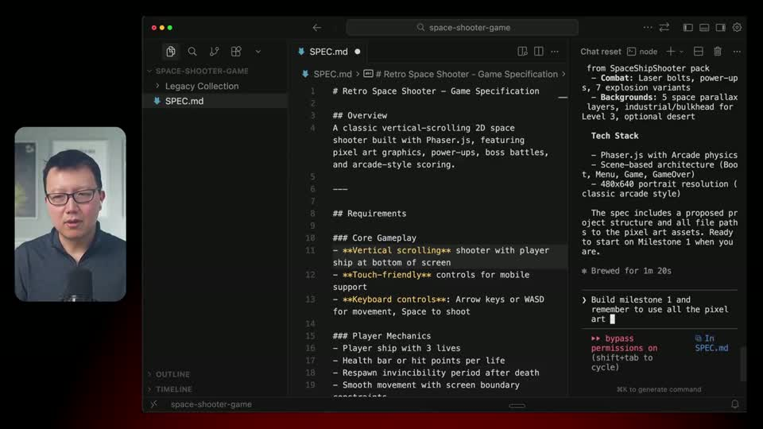
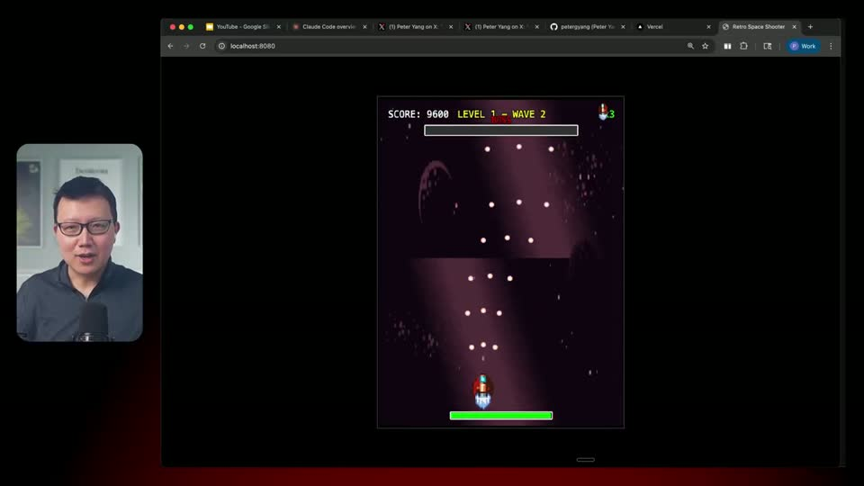
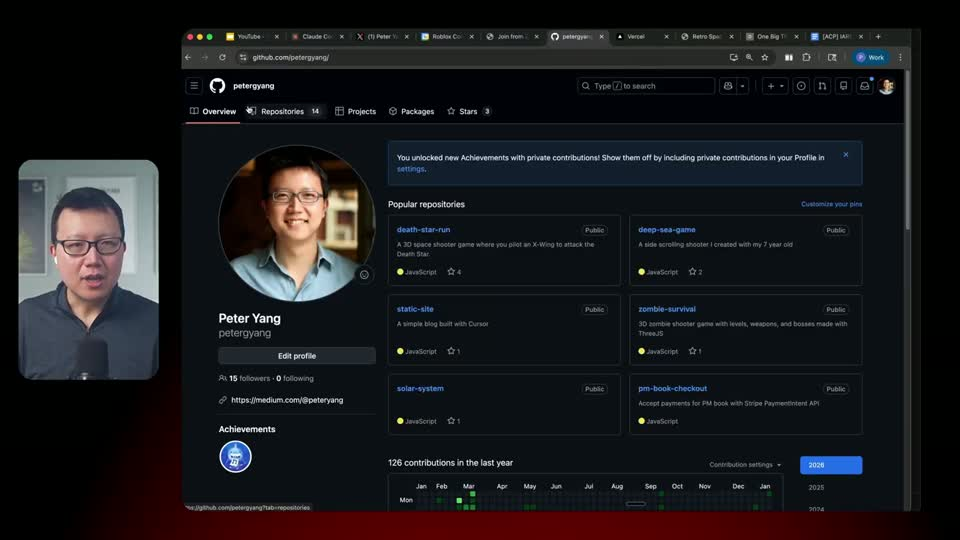

# Build a 2D Space Shooter with Phaser and Claude Code

## Why it matters here

This is a compact example of AI-assisted browser-game prototyping that starts from a human-readable game idea, turns it into a spec through questions, builds playable milestones, and ships a hosted demo.

## Summary

- Phaser's article highlights Peter Yang's 20-minute tutorial for building a retro vertical space shooter with Claude Code.
- The workflow uses Cursor, Claude Code, free pixel art assets, Claude Code's `AskUserQuestion` pattern for spec drafting, iterative playable milestones, and deployment through GitHub and Vercel.
- The resulting game includes scrolling shooter basics, enemy waves, power-ups, boss battles with health bars, screen shake, and debugging of a more complex boss encounter.
- The original Peter Yang post adds useful concrete anchors: a playable demo at `space-pixel-shooter.vercel.app`, the `Legacy Pixel Collection` from Animus, and a five-step tutorial sequence from setup to shipping.

## Workspace takeaways

- The reusable pattern is not "ask AI to make a game" in one prompt. It is: gather assets, have the agent ask design questions, write a spec, build a thin MVP, then add features in controlled milestones.
- Phaser remains a good target for fast browser-first game experiments because a shipped demo can be as simple as a Vercel deployment.
- For child-friendly or voice-driven co-creation, the article is a useful example of pairing an AI coding agent with dictated design intent rather than expecting the human collaborator to type or code.
- For workspace game projects, preserve this as a reference for milestone discipline: MVP first, then waves/power-ups, then boss mechanics and polish.

## Source access note

The Phaser page redirected direct browser fetches to a preview gate during ingest, but the article metadata and body summary were available through search indexing. The related Peter Yang post and Class Central entry corroborated the tutorial structure, video duration, author, and syllabus-level sequence.

## Source

- source URL: https://phaser.io/news/2026/02/phaser-claude-code-tutorial
- video URL: https://www.youtube.com/watch?v=247Z3jdw_hs
- subtitle source: YouTube `en-orig` automatic captions retrieved with `yt-dlp` on 2026-04-18
- transcript policy: the full verbatim caption file is not copied into this repository; the durable KB copy keeps source links, time anchors, screenshots, and detailed segment notes for retrieval and review.

## Selected screenshots

## Video notes by anchor

### 00:00: why Peter Yang likes building games with his child using Claude Code

The tutorial opens by framing Claude Code as a weekend co-creation tool. Peter Yang says he builds games with his seven-year-old and uses that as motivation for a beginner-friendly workflow. He shows prior examples, including an underwater shooter and an animal hospital game using AI-generated images, then introduces the target project: a retro 2D space shooter built in five steps. The steps are project setup, asset discovery, spec drafting, MVP/milestone implementation, and final cleanup plus shipping.

### 01:19: project setup

The setup starts with an empty `space-shooter-game` folder opened in Cursor. Cursor is used because the file tree makes Claude Code's edits visible while the terminal remains available. The install recap points viewers to Claude Code's quick-start command, then starts Claude Code from the Cursor terminal. Yang prefers `claude --dangerously-skip-permissions` for this kind of disposable hobby folder because it lets the agent work without repeated permission prompts. The note is intentionally scoped to fun prototypes, not sensitive or production work.

### 02:56: free pixel-art asset selection

The asset section demonstrates using voice dictation and Claude's web search to find free retro 2D space-shooter pixel art. Claude suggests sources such as OpenGameArt and itch.io, but Yang uses Animus's `Legacy Pixel Collection` to keep the tutorial concrete. He downloads the pack, drags it into the project folder, and asks Claude to inspect the folder and list assets suitable for a space shooter. The important retrieval pattern is that the agent sees real filenames before implementation, so it can bind player ships, enemies, bullets, power-ups, backgrounds, and boss art to actual files.

### 05:33: drafting the spec with Claude Code's AskUserQuestion flow

The spec prompt asks Claude Code to write requirements, divide the work into three playable milestones, link the pixel art assets that will be used, and use `AskUserQuestion` if clarification is needed. Yang calls out three practices: write the spec before building, break the work into testable milestones, and make the asset mapping explicit. Claude asks about the technology platform, scrolling direction, and desired features. Yang chooses Phaser, top-down vertical shooter gameplay, power-ups, boss battles, score, and multiple waves. The generated spec describes a vertical scrolling shooter, basic combat, progression/power-ups, boss battles, and polish. Yang also warns that generated specs often include too much, so humans should cut scope before implementation.

### 08:56: MVP build and iteration

The first implementation request builds milestone 1 and reminds Claude to use the linked pixel art. After a short wait, the game runs locally with a movable player ship, shooting, enemies, and a working but rough background. Milestone 2 adds more enemy variety, screen shake, and a health bar, though some sprites still look wrong. Before milestone 3, Yang asks which sprites will be used for boss battles, then tells Claude to search the larger Legacy Pixel Collection when the first answer is weak. Claude finds a top-down boss folder and proceeds. The resulting game has waves, power-ups, a boss trigger, and enough friction to expose gameplay tuning and art issues.

### 13:06: boss-battle debugging

The boss debugging section shows why visual feedback matters. The game warns that a boss is approaching, but the boss does not appear and the UI shows zero HP. Yang takes a screenshot, pastes it into Claude Code, and explains the failure. Debugging takes longer than the earlier build steps, and he adds a hotkey to trigger the boss directly for faster testing. The fix centers on boss HP state being stored on a Phaser object where engine behavior can interfere; moving HP to scene-level state resolves the issue. The broader lesson is to keep iterating through hard bugs, use screenshots as evidence, and ask the agent to explain the root cause after the fix.

### 15:24: shipping with GitHub and Vercel

The shipping section creates a GitHub repository named after the local folder, copies the remote URL, and asks Claude Code to commit and push the project. Yang notes that the tutorial pushes more of the asset pack than ideal; a cleaner version would include only the files actually used by the game. For hosting, he uses Vercel: create a free account, add a new project, paste the Git URL, and deploy. The deployed game gets a public URL, and the final playthrough confirms the boss fight, power-ups, level completion, and changing backgrounds. The closing recap repeats the five-step loop: setup, assets, spec with `AskUserQuestion`, three milestones, bug fixing, and deployment.

## Follow-up

- If a workspace Phaser prototype starts, test whether this flow works better as a written `docs/specs/` questionnaire before implementation or as an interactive agent loop inside the coding tool.
- Capture the actual prompts and milestone boundaries if the team applies this to a local game project.
